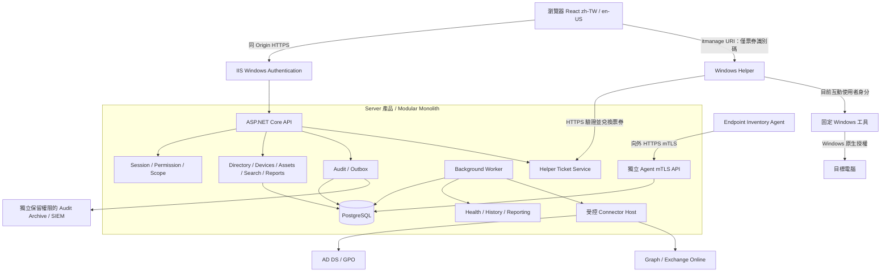

# IT Management Console — Phase 1 架構設計

狀態：架構方向已由需求方確認，Phase 2 開發中。版本：0.1，2026-09-11。本文描述目標架構，實際完成範圍以 deployment/phase2.md 為準。

## 1. Architecture Overview

採 **Modular Monolith**。三個產品共用必要 DTO 與協定契約，但不共用權限或執行身分：

| 產品 | 職責 | 執行方式 | 明確界線 |
|---|---|---|---|
| IT Management Web Server | 驗證、授權、資產、AD、Connector、報表、稽核與排程 | Windows Server 上 IIS + ASP.NET Core；另有同版本 Worker / Connector Host | 不透過 Agent 執行管理命令 |
| Endpoint Inventory Agent | 本機唯讀盤點、Heartbeat、上傳快照、處理固定盤點請求 | Windows Service，僅向外 HTTPS | 不提供遠端 Shell、檔案傳輸、安裝、重啟、設定修改 |
| Windows Management Helper | 在登入管理員的工作站啟動指定 Windows 工具 | 非提權的互動式 Windows App | 不代理平台身分、不內含網域憑證、不接受任意命令 |

Worker 與 Connector Host 是 Server 產品的部署程序，並非新增獨立微服務產品。核心模組保持單一版本與 release train；程序隔離是為了拆開憑證與故障範圍。

V1 生產部署基線：加入網域的專用管理 Windows Server、IIS HTTPS、獨立 PostgreSQL 主機或受控資料庫；不部署在 DC。React 與使用者 API 同 Origin。Agent 使用另一個可設定的 DNS 端點與 mTLS listener；可位於同一管理主機。預設不引入 Redis、訊息叢集或 Kubernetes，先用 PostgreSQL durable jobs / outbox。

使用 EF Core + Npgsql 管理 Migration；C# nullable、強型別 DTO、DI、非同步 I/O、集中 ProblemDetails、結構化日誌。套件於實作階段鎖定相容的受支援版本、產生 lockfile 與 SBOM，不在本設計假設所有最新套件皆可相容。

Environment 是組態、資料與授權隔離單位，不是公司名稱字串。預設一家公司一套部署；單一部署可支援多 Environment，但不作為互不信任公司的強隔離 SaaS。若需要此種隔離，採分開部署、資料庫與金鑰。

跨不互信 AD 網域不假設自動 SSO 或 Kerberos delegation：V1 每套部署有一個登入信任範圍，其他 Environment 可由其獨立 Connector 存取；其他登入來源須另行設計，或分開部署。

## 2. Component Diagram



模組擁有自己的 Domain / Application / Infrastructure，透過明確介面互動；禁止前端直接接 LDAP、Graph 或資料庫。Connector 使用固定操作與 DTO，不提供任意 PowerShell/LDAP/SQL 入口。Shared 只放值物件、協定與公開契約，不把 EF Entity 散播到 Agent 或 Web。

## 3. Data Flow

### 使用者請求與外部變更

1. IIS 完成 Windows 驗證；API 以受信任的 Windows principal 建立平台 session。
2. 以 SID / issuer+subject 識別操作人，載入 Environment membership、Permission、Scope 與授權版本。
3. 查詢先套 Environment + Scope，再計數、分頁、投影及輸出；搜尋、Dashboard、報表也一樣。
4. 變更先產生不可變 ChangePlan：目標 objectGUID、前值、預期版本、diff、排除項、風險、理由、到期時間與計畫 hash。
5. 人工核准綁定確切 plan/hash；執行時重新檢查操作人、核准者、Permission、Scope、Protected Object、目標版本。變動則要求重建計畫。
6. 稽核意圖持久化成功後交 durable job；受限 Connector 執行並讀回實際結果，記錄成功、失敗、部分完成或結果不確定。

本機 DB 交易和 AD/Graph 寫入不能組成 ACID 交易。不得假裝 exactly-once。外部 timeout 後先核對結果；非冪等動作禁止盲目重試。批次逐項留結果，不將全部重新送出。補償也是新受審查變更，不保證能回復密碼或所有外部狀態。

### Agent 與盤點

註冊 → 綁定裝置憑證 → Heartbeat / pull request → 本機唯讀蒐集 → snapshot ingest → 快照與目前狀態原子更新 → diff / health / search projection。

Server 以收到資料的時間判斷連線；Agent 的 observedAt 只代表蒐集時間。亂序快照可以留歷史但不能覆蓋較新 current state。每個欄位標示來源、觀測時間、品質與錯誤，不把缺資料轉成 false / healthy。

### 查詢新鮮度

AD / Graph / Exchange 由排程同步讀模型；頁面顯示來源與 lastSyncedAt。寫入讀回後更新 projection，並標註尚待同步項。不同來源衝突按欄位權威來源處理，不採最後寫入全面覆蓋：AD 管理 directory identity、Agent 回報本機 observation、人工輸入管理 lifecycle/notes。

## 4. Security Boundary

| 邊界 | 信任與限制 |
|---|---|
| Browser → API | 所有 API 預設需驗證；Permission + resource Scope 必須在伺服器判斷；變更需 anti-forgery 與 Origin 檢查 |
| Environment | 所有業務資料有 environment_id；複合外鍵阻止跨環境關聯，DB RLS 作第二道防線；快取與背景工作同樣隔離 |
| API → Connector | Web 身分不持有 AD 寫入、Key-read 或雲端管理憑證；Connector 固定操作白名單、獨立身分與最小委派 |
| Endpoint → Ingest | 裝置只是自己盤點資料的提供者；不能授權使用者、選擇別的 deviceId 或宣稱自己是可信合規設備 |
| Helper → Windows | 平台只核准 launch；目的端 Windows ACL、RDP logon rights 等仍是最終權限 |
| Secret / Recovery Key | Secret Store / Windows Certificate Store；資料庫只保存 secret reference；Recovery Key 不進 DB、queue、cache、日誌或報表 |
| Audit | 稽核寫入先於敏感副作用；不能持久化稽核則敏感操作 fail closed；外部存檔補強抗竄改 |

每個 Environment 的讀取、写入、Recovery Key Connector 身分分離；只委派必要 OU/屬性/動作，不用 Domain Admin。GPO/Exchange 另有受限 adapter；不能由前端傳入腳本或 executable 路徑。Connector host IPC 限本機受控端點與 OS ACL，依固定結構化請求及短期授權票券處理。

資料傳輸 HTTPS；正式端點必須信任的 DNS TLS 憑證。IP 可以顯示與查詢，不能作為識別或預設設定。換 IP 更新 DNS 與必要網路路由即可；DNS 名稱更換則是另一次受控端點遷移。錯誤憑證不可忽略。Server Settings 分開顯示外部宣告 DNS/API URL、實際 NIC/IP、TLS 到期與服務健康，不能以單一本機 IP 猜測 public endpoint。

回復金鑰流程調整為：Permission + Scope → fresh step-up → 理由 → durable intent audit → 即時讀取 → durable result audit → no-store 回應。若 result audit 失敗則不揭露。畫面短時遮蔽、不可放 URL 或 localStorage，禁用 response body capture/session replay；最多保留 key metadata 與存放來源。瀏覽器已收到的秘密無法保證從使用者記憶體、截圖或剪貼簿消失，限時 UI 不是撤回機制。

### 需求中必須採用的澄清

- BIOS ReleaseDate 是 BIOS 發行日期，不能當實際製造日期；保留為低可信估算，清楚標示。優先 verified manufacturing date，未知時用 firstSeen 表示「至少已觀測多久」，不聲稱為真實機齡。[Microsoft Win32_BIOS](https://learn.microsoft.com/en-us/windows/win32/cimwin32prov/win32-bios)
- Agent read-only 指不修改被管理設定；允許寫入自身身分、去重/序號、受限離線 spool 與日誌。升級由企業軟體部署工具完成，Agent 不提供自我下載執行。
- 「立即盤點」表示排隊後由 Agent 輪詢取得，不是 Server 連入 Endpoint；離線時不宣稱已完成。
- GPO GPUpdate 是 Connector 的獨立受授權操作，絕不下發給 Inventory Agent。
- `itmanage://rdp/任意主機` 不作正式可執行協定；改成不可竄改、單次、短期票券，防止任意網站誘發對非授權主機的連線。
- V3 的完整 Approvals UI 不代表 V1 可以省略高風險變更核准。V1 即有最小核准紀錄及精確計畫綁定。

## 5. Database Schema

完整邏輯模型、鍵值、隔離、歷史與保留策略見 [database.md](database.md)。此階段輸出設計，不將概念 schema 冒充已執行 Migration。

核心關係：Environment → role assignments / connector configs / devices / directory objects；Device → snapshots / inventory components / health / notes；Directory user ↔ Device 經帶來源與時間的 association；Permission 透過 RolePermission 與帶 Scope 的 RoleAssignment 授權。

## 6. Authentication Design

### 日常登入

正式基線採 Windows Server + IIS Windows Authentication，使用 FQDN 與 HTTP SPN 的 Kerberos 設定；實際佈署需驗證 SPN 唯一性、瀏覽器 zone、服務帳號與負載平衡。不要將「Negotiate 成功」等同 Kerberos 成功，驗收必須辨識實際協定。IP 直連不作 Kerberos 正式路徑。

ASP.NET Core 支援 Windows Authentication，但 Kestrel Negotiate 經 proxy 有連線 affinity 條件；因此本案不以任意通用 proxy + Negotiate 為預設。[Microsoft Windows Authentication](https://learn.microsoft.com/en-us/aspnet/core/security/authentication/windowsauth?view=aspnetcore-10.0)

IIS 提供明確隔離的 Windows bootstrap path；API 建立伺服器端 session，瀏覽器只有 Secure、HttpOnly、SameSite cookie。IIS/API 不信任外部 identity header；Kestrel 私有 binding 不允許绕過 IIS。登入 fallback 頁面提供重試 SSO 與 emergency login，不收集網域密碼進行 LDAP simple bind。

Session 保存 principalId、authMethod、authTime、stepUpAt、authorizationVersion、lastSeen、revocation、來源 IP 與 User-Agent。預設 idle 20 分鐘、absolute 8 小時、step-up 5 分鐘，均為可調且有安全下限/上限的 Environment policy；到期檢查在 Server 執行。AD group mapping 使用 SID 而非顯示名，定期刷新且敏感操作即時再確認；AD 不可達時不沿用快取權限進行高風險動作。

Windows SSO 不作高敏感 fresh verification。Recovery Key、RBAC/Owner 等操作使用 WebAuthn/FIDO2；Phase 2 完成可用驗證器與 recovery drill 前，相關動作保持停用，不以點一次確認代替。

### Emergency Local Owner

僅本機受控 bootstrap 工具建立，沒有 Web 首次註冊、自動第一個登入者成為 Owner 或預設密碼。Owner 所屬 Environment 必須明確；平台部署管理權不自動等於所有 Environment 的資料管理權。

採 ASP.NET Core Identity 的版本化密碼雜湊策略及可升級參數、強隨機離線保管密碼、FIDO2 第二因素和單次 recovery codes；帳號預先佈建兩把受控金鑰並演練 AD 故障。限制管理網路來源、rate limit、逐步延遲與 lockout/recovery 流程；使用時警示並稽核。禁止每日使用。認證金鑰與 Data Protection keys 有受限持久儲存及備份。

Windows bootstrap 與 emergency 匿名入口的 IIS 設定需分別驗證，避免 AD 故障時被 IIS Windows challenge 擋住。無驗證健康檢查只回傳存活，不暴露版本、連線字串或網域資訊。

## 7. RBAC Design

授權規則：`Authenticated AND EnvironmentMembership AND Exists(Assignment with Permission AND matching Scope) AND OperationPolicy`。同一 assignment 的 Permission/Scope 必須一起成立，不能把 A 角色的寫入權搭配 B 角色的廣域 Scope。無匹配則拒絕。

Scope 以型別化規則儲存：All、OU subtree（objectGUID + 明確 descendants 模式）、Department、Group SID、DeviceTag UUID。assignment 內多條規則預設 OR；若要 AND 必須明確的受限 expression tree。Unknown scope field → 不匹配；Directory 移動或 membership 變更會更新 scopeVersion。群組/OU 的編輯與成員跨範圍操作同時檢查兩端資源。

| 角色 | 預設用途 | 強制限制 |
|---|---|---|
| Owner | Environment、Connector、RBAC、所有業務管理 | 仍受環境、scope、step-up、保護與核准規則約束；不是 Domain Admin |
| Admin | 日常 IT、AD 與資產操作 | 不可修改 Owner、轉移所有權或最高層安全設定 |
| Manager | 範圍內人員、資產、狀態與報表 | 預設唯讀，需有明確 scope |
| Member | Helpdesk 查詢、解鎖/重設密碼、資產操作 | 不含特權物件、Key-read、RBAC/GPO；每個動作獨立 permission |
| Viewer | 可見範圍唯讀 | 不修改；Export 與敏感欄位不是自動包含 |
| HR | 人員、部門、入離職狀態及人員報表 | 不預設配發直接 AD mutation、遠端、C$、LAPS secret、Key-read、GPO 或管理群組權限 |

Permission catalog 包括需求所列 User / Group / Computer / BitLocker / GPO / Exchange / Entra / Report / Audit / System / RBAC，額外拆出 `Environment.Manage`、`Connector.Manage`、`Asset.Edit`、`Inventory.Request`、`Owner.Transfer`、`Owner.Remove`、`Security.Manage`、`Change.Approve`。角色可自訂，不允許自訂角色繞過 Owner-only 系統 invariant。

Owner 轉移須目前 Owner fresh step-up、接任者確認與 transaction 中最後 Owner 防護；AD Group Mapping 不允許提升為 Owner。Admin 不可透過修改任意 RolePermission、mapping 或 scope 間接提權。Protected Objects 由 stable SID/objectGUID、特權群組傳遞成員與人工標記組成，不能只比對英文名稱或 adminCount；保護判定未知時敏感變更拒絕。批次預設排除，例外需逐物件顯示並另行核准。

UI 收到 capabilities `{allowed, available, reasonCode}`。授權和可達性分開，狀態永遠保留文字/icon；Disabled action 顯示本地化原因。Server 每次再檢查，不信任前端 enabled 狀態。支援端口只表示 transport 可達，不代表使用者可用該服務。

## 8. Agent Protocol

### 註冊與生命週期

1. 管理員建立一次性短效 enrollment grant，綁 Environment、部署批次及可核對的預期設備。只保存 token hash，設定有效期、次數與 rate limit，禁止共用永久 token。
2. Agent 在本機產生不可匯出私鑰，优先 TPM-backed；提交 CSR 與 bootstrap token。UUID、Serial 只是比對線索，不能單獨證明身分。
3. Server 驗證 CSR possession、grant、nonce、限制與重複狀況；無可信預綁時進人工 pending approval，絕不自動依 hostname 接管既有裝置。
4. Server 產生 deviceId 與 registrationId，透過受控 CA 簽發 client-auth 憑證。CA 私鑰不在 Web API 程序；產品 V1 須完成 signer adapter、撤銷與恢復流程才可生產。
5. 後續 mTLS 以 issuer+serial/thumbprint 對應 active registration。payload 中環境/裝置不得覆寫 certificate binding。
6. 在到期前續期，驗證舊私鑰 possession、registration 狀態與新 CSR；短暫雙憑證 overlap 後撤銷舊憑證。到期、revoke、clone 與重灌都有受控重新註冊流程。

### 協定端點與資料

| Endpoint | 認證 | 行為 |
|---|---|---|
| `POST /agent/v1/enrollments` | 一次性 grant + CSR proof | 回 pending 或已核准憑證；不接受現有 deviceId claim |
| `POST /agent/v1/certificates/renew` | active mTLS + CSR proof | 受控 renewal |
| `POST /agent/v1/heartbeats` | active mTLS | 更新 server-received lastSeen、版本與能力 |
| `GET /agent/v1/inventory-requests/next` | active mTLS | pull 固定 request，租約/expiry，不回任意動作 |
| `POST /agent/v1/snapshots` | active mTLS | 去重、schema/version/size 校驗、持久化快照 |
| `POST /agent/v1/inventory-requests/{id}/result` | active mTLS | 僅自己的有效 request，狀態/固定錯誤碼 |

Heartbeat 建議 60 秒、±20% jitter；pull 30 秒；完整盤點 24 小時，均可配置且有防過載限制。Online `<120s`、Stale `120s..900s`、Offline `>900s`；尚未有 heartbeat 顯示 Never Connected，另列 enrollment 狀態。時間門檻是 policy 值，不散落 hard-code。

每個有副作用的請求帶 `protocolVersion, registrationEpoch, sequence, requestId, observedAt, payloadHash`。Server 以 registrationEpoch+sequence 唯一鍵、有限亂序 window 與保存期限去重；相同 key/hash 回原結果，不同 hash 拒絕；heartbeat 必須有新序號才能刷新 lastSeen。持久化序號防重啟回退；長期離線快照另外檢查允許的歷史窗口。只靠 timestamp 不足以防重播。

inventory request 只含 `{id, kind: InventoryRefresh, profileVersion, expiresAt}`，profile 只能選擇已編譯的 collector 集合；不含命令、script、URL、任意路徑、WQL 或 DLL 名稱。離線重試 exponential backoff+jitter；本機 spool 有大小/天數上限、OS ACL、敏感資料最小化，重送不重複產生 history。

Collector 使用 Win32/CIM/Registry read APIs，軟體以 32/64-bit uninstall registry 為主，禁止 Win32_Product。SSID、登入者等依隱私 policy 蒐集；不讀 Wi-Fi 密碼、LAPS 密碼或 BitLocker recovery value。只能證明本機觀察狀態，不將 Agent 上傳的「escrowed」當 AD/Entra 有 Key 的證據。逐 collector 設 timeout、失敗隔離、最大輸出與 Unknown/NotApplicable/AccessDenied。

以服務 SID / 最小權限帳號為目標；需權限較高的 Windows API 逐項實測，不以全功能為由預設 LocalSystem。无法取得欄位就標示 unavailable。MSI、binary、release manifest 簽章；供應鏈更新透過獨立企業部署管道。

## 9. Helper Protocol

正式 URI：`itmanage://launch/<opaque-one-time-ticket-id>`。action/hostname 不信任 URL，而在平台已授權的 ticket 中固定。Helper 的 Server URL 與信任憑證由安裝政策指定，不能由 URI 選擇。

Web POST ticket → Permission + Scope + 目標與 DNS policy + durable audit → 60 秒單次票券（DB 保存 hash）→ Helper 透過 Windows 認證 HTTPS 及受控工作站私鑰 proof 兌換 → Server 重驗發行 session 與當前授權 → Helper 本機驗證 server-signed claims 的簽章、issuer/audience、登入者 SID、工作站、環境、expiry、nonce 與目標 → 本機顯示 action/target 確認 → 向 Server 原子 consume → 固定 launcher。兌換取得 claims 不授權重複啟動，最終 consume 才取得一次性執行權。

受控安裝先註冊 Helper workstation binding 與信任公鑰；不得由 URI 決定信任來源。票券綁原始 browser session，但 Helper 不讀取 browser cookie，Server 以發行記錄檢查 session 未撤銷。Public-key rotation 只能經既有信任鏈或受控安裝政策。

Helper 回報只能標示 tool launch 成功/失敗，不能宣稱 RDP 已登入或檔案存取成功。任意網站無法發行有效票券，但仍保留確認以防誘導。無票券服務或無法驗證目前管理員時拒絕；不開 localhost HTTP server，也不自動提升 UAC。

| 固定 action | 本機工具 | 驗證 |
|---|---|---|
| Rdp | 系統目錄 mstsc.exe `/v:<dns>` | 只允許 inventory 中批准的 DNS 主機 |
| Explorer | 系統目錄 explorer.exe `\\<dns>` | 不允許任意 UNC path |
| CShare | 系統目錄 explorer.exe `\\<dns>\C$` | 需 Computer.OpenShare 及對應 policy |
| ComputerManagement | 系統目錄 mmc.exe + 固定 compmgmt.msc | 遠端參數在支援 OS 驗證 |
| EventViewer | 系統目錄 mmc.exe + 固定 eventvwr.msc | 不接受任意 .msc |
| Services | 固定 Services 管理介面 | 若指定 OS 不支援直接切遠端，顯示原因並由受支援 Computer Management 路徑進入 |

使用 ProcessStartInfo.ArgumentList 與固定絕對系統路徑，不經 cmd.exe/PowerShell、shell string concatenation 或 PATH 搜尋。host 只允許正規化 DNS label，拒絕 IP、port、slash、反斜線、空白、引號、控制字元、百分比二次解碼與長度超標。限制授權 DNS suffix/資產目標，處理改名後重新核對。

Explorer、MMC 可能讓使用者在原生 UI 改選其他主機；平台票券只能限定初次啟動，不能把這些工具變成完整受控遠端管理代理。敏感端點仍需網路與 Windows ACL 控制，UI 清楚說明 audit 只覆蓋 launch。

「複製 UNC」只複製目前可見裝置的正規化路徑，不執行工具。未安裝 Helper 的狀態顯示 Unknown/Unavailable；不能只憑 timeout 宣稱安裝成功，可使用一次性診斷 challenge 與已驗證版本回報。

## 10. API Structure

使用者 API 前綴 `/api/v1/environments/{environmentId}`，tenant/environment 不從 payload 自行採信。平台登入為 `/api/v1/session`；環境清單只回授權 Environment。OpenAPI 產生 TypeScript client，Entity 不直接作 DTO。

| 資源 | 主要端點與行為 |
|---|---|
| Session | bootstrap / me / logout / step-up；GET 不執行變更 |
| Environments | GET/POST，GET/PATCH `{id}`；creation 需平台 provisioning 權限 |
| Directory | GET users/groups/computers/ous，GET `{id}`；建立/編輯/停用/重設密碼/成員/移動經 change-plans |
| Devices | GET devices、`{id}`、`{id}/inventory`、health、history、notes、audit；PATCH notes/lifecycle 需 ETag |
| Inventory | POST `devices/{id}/inventory-requests` → 202 + job URL |
| Diagnostics | POST `devices/{id}/diagnostics` → 固定 probe 工作；不能指定任意 host/port |
| Helper | POST `devices/{id}/helper-tickets`；兌換為獨立 Helper-auth endpoint |
| BitLocker | GET status；POST `devices/{id}/recovery-key-reveals`，reason+step-up，不走一般報表 job |
| Changes | POST change-plans、GET `{id}`、POST approvals、POST execution；驗證 plan hash、expiry、version |
| Search | GET search?q，跨類型但先套 scope，固定欄位白名單 |
| Reports | GET definitions，POST report-jobs，GET jobs/{id}，GET authorized artifact download |
| Policy / RBAC | 受 Owner 限制的 roles、assignments、group-mappings、policies；版本與 audit |
| Audit / Connectors | GET audit；GET connector-status；設定變更經安全策略與稽核 |

回應分頁為 `{items,nextCursor,total?}`，預設 50 / 最大 200、排序白名單與 id tie-breaker；total 不可洩露 Scope 外數量。Filter 採型別化 DSL，限定欄位/operator/depth/length，不收 raw SQL/LDAP。LDAP filter/DN 使用適當 escaping 與 GUID 定位，不能拼接使用者輸入。

UTC ISO8601 時間、GUID IDs、ETag/If-Match、Idempotency-Key（帶 principal/env/action/body hash）。錯誤用 ProblemDetails + 穩定 code + traceId，400 validation、401 unauthenticated、403 denied、404 scoped-not-found、409 conflict、412 stale version、422 unsupported operation、429 throttled、503 unavailable。技術細節只到已遮罩日誌。

Report Definition 包含受控 dataset、typed filters、columns、sort 與格式；不是任意 query engine。報表建立、執行、下載皆重驗授權；成果有短期保留、不可猜路徑、加密儲存與撤銷檢查，不用公開永久 URL。Excel 儲存字串為文字避免 formula injection，不匯出 Recovery Key/secret；大型工作串流生成並配額限制。

## 11. Project Directory

以下為預計實作結構；目前只建立 docs 與 README。

```text
src/
  Server/
    Api/                     # IIS-facing user API
    AgentIngress/            # dedicated mTLS authentication
    Worker/                  # durable jobs / outbox
    ConnectorHost/           # bounded privileged adapters
    Modules/
      IdentityAccess/
      Environments/
      Directory/
      Devices/
      Inventory/
      Health/
      Reporting/
      Audit/
      Changes/
      Integrations/
  Web/
    src/app/
    src/features/
    src/components/
    src/api/
    src/locales/zh-TW.json
    src/locales/en-US.json
  Agent/
    Service/
    Collectors/
    Transport/
    Packaging/
  Helper/
    App/
    Protocol/
    Launchers/
    Packaging/
  Shared/
    Contracts/
    AgentProtocol/
  Infrastructure/
    Persistence/
    Migrations/
    Secrets/
tests/
  Unit/
  Integration/
  Security/
  EndToEnd/
docs/
  architecture/
  api/
  deployment/
  security/
build/
  ci/
  packaging/
```

設定範例 `.env.example`、`appsettings.example.json` 只放 placeholders。Demo 用獨立 datastore 與替代 connector，必須顯著標籤；Production 啟動拒絕 demo auth、seed owner、fake key 與關閉 TLS 驗證。禁止根據「連線失敗」自動退回 Demo。

## 12. V1 Scope

V1 完成可實際驗證的 auth/RBAC/Environment、Dashboard、AD 使用者/群組/電腦/OU、Device Detail、唯讀 Agent、盤點 API、Health、Age、AD BitLocker status/JIT key、Excel、Audit、Helper、Global Search。Cloud adapters 先只保留介面與 unavailable 狀態，Graph/Entra 在 V2、Exchange 在 V3；不假稱已有雲端整合。

AD V1 包含搜尋/詳細、user template、建立/批次匯入、屬性修改、enable/disable、scheduled disable、unlock/reset password、群組成員、OU browse/move，皆經 scoped change pipeline 與保護/核准。建立密碼等秘密不進 plan diff 或 queue；用短效 secret reference，排程执行再取得必要祕密。域變更能力需隔離測試網域驗證後才啟用，不能以 mock 驗收。

Device Detail tabs：Overview、Health、Hardware、Software、Network、Security、AD、User、History、Notes、Audit。快捷按鈕全數保留，未具權限/未配置/不可達顯示 Disabled + Tooltip。全域搜尋與雙向 User↔Computer 保留来源及歷史；Agent 的「目前登入者」不等同資產所有人，支援多互動 session。

Dashboard 包含 AD、人員、電腦連線、Health、Security、M365 與 Remote Management panels。未接入 M365 顯示「未設定」，不能顯示 0 作為健康證據。Priority Inbox 對應 scoped filter；數量與點入清單一致。V1 支援基礎 tags 與 lifecycle 作 Scope/篩選；V2 再擴充 tags 管理、Saved Filters 與 Compliance。

Health 保存 evidence 與 ruleVersion；online 狀態以 heartbeat 為主，Ping fail 不直接判 Offline。狀態為 Healthy/Warning/Critical/Unknown，probe 另有 NotApplicable/Unavailable。score = 可用評分项的加權分數；同時輸出 evidenceCoverage，低於 policy 最低 coverage 時整體 Unknown，不可把缺值視為通過。新鮮且確定的 Critical Override 優先於分數；Agent 極度 stale 可獨立產生 critical，其他過期安全觀測不能當現況。

Age 顯示 estimate/source/confidence；verified manufacturing date 優先，BIOS date 僅低可信參考，firstSeen 是觀測下限；install date 不作主要機齡。更換主機板造成序號/UUID 變化先標 identity conflict，不自動新建或合併。Replacement 由可版本化 policy 綜合 age/health/disk/RAM/lifecycle/support/repairs，顯示各理由；未知值不能自動導出 Low。Windows support 來自版本化 lifecycle dataset，附來源及 lastVerifiedAt。

V1 Excel 具有設備總表、硬體資訊、軟體清單、安全狀態、健康狀態、盤點歷史、建議汰換七張工作表；支援目前 filter/scope 與單機報告。PDF 單機報告安排 V2 Advanced Reporting，明確標示 V1 unavailable。V1 不自動清除 ghost AD objects、不執行完整 offboarding、沒有通用 automation runner。

UI 採高密度深灰 panels、低對比 border、少動畫；狀態同時有文字/icon。繁中預設、英文完整 translation keys，包含 validation/error/tooltip/報表欄名；使用者偏好存 Profile，未登入前可用 local preference，缺 key 回 fallback language 並在 CI 驗證雙語 key parity。前端保留 keyboard navigation、可見焦點、對比與表格可存取性。敏感與個資不送第三方 analytics。

## 13. Development Roadmap

維持使用者的 Phase 1–12 順序；每一階段 Implement → Build → Test → Fix → Document → commit-ready。Audit 的基礎必須提前在 Phase 2 建立，Phase 11 完成查詢、封存及抗竄改整合；安全測試從 Phase 2 持續，Phase 12 為独立總驗收，不能把安全全延至最後。

各階段產物、測試與上線阻擋條件見 [roadmap.md](roadmap.md)。本轮不建立大量程式碼；確認此架構後下一步為 Phase 2 的資料庫、Authentication、RBAC 及最小 Audit/Change pipeline。

### 後续 Cloud Connector 的依據

MFA registration 與 MFA enforcement/sign-in success 是不同資料，不互相推論；adapter 依官方 endpoint 的最小權限與授權條件設定，另驗證 tenant license。[Graph userRegistrationDetails](https://learn.microsoft.com/en-us/graph/api/authenticationmethodsroot-list-userregistrationdetails?view=graph-rest-1.0)

Graph 的 recovery-key metadata 與實際 key 讀取分離；選取 key 有額外敏感權限與來源端 audit，平台仍需自己的揭露紀錄。[Graph bitlockerRecoveryKey](https://learn.microsoft.com/en-us/graph/api/bitlockerrecoverykey-get?view=graph-rest-1.0)

Exchange 管理使用其受支援 PowerShell adapter，不假設 Microsoft Graph 可涵蓋所有管理功能；app-only certificate authentication 與 cmdlet RBAC 逐功能驗證，不能把 application access scope 直接等同所有 PowerShell cmdlet scope。[Exchange app-only authentication](https://learn.microsoft.com/en-us/powershell/exchange/app-only-auth-powershell-v2?view=exchange-ps)
